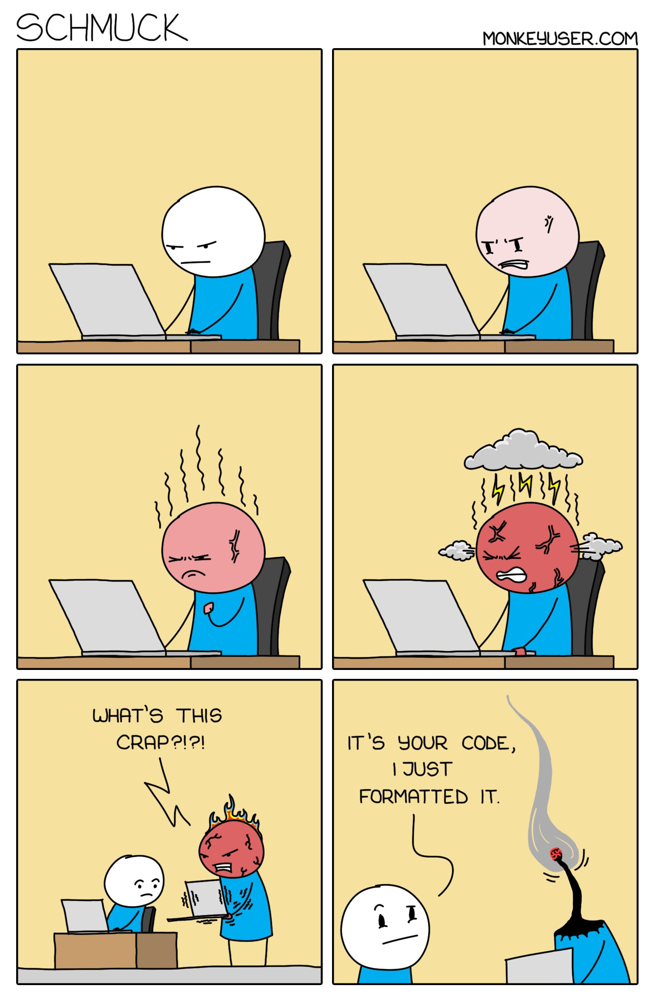

### 第四期
- **schmuck**

- **[Website IP](https://chrome.google.com/webstore/detail/website-ip/ghbmhlgniedlklkpimlibbaoomlpacmk)**  
Google chrome 插件，此扩展程序只是将您正在查看的当前网站的 IP 添加到右下角

- **docker 可视化管理平台**  
为了方便容器化调试，拥有一个熟悉的可视化管理平台是比较好的
  - [Lazydocker](https://github.com/jesseduffield/lazydocker) (by @dennis)  
  `LazyDocker` 是基于终端的一个可视化查询工具，支持键盘操作和鼠标点击。相比 Portainer 来说可能不那么专业，不过对于开发者来说可能反而更加好用了
  - [Portainer](https://www.portainer.io/)  
  `Portainer` 是 Docker 的图形化管理工具，提供状态显示面板、应用模板快速部署、容器镜像网络数据卷的基本操作（包括上传下载镜像，创建容器等操作）、事件日志显示、容器控制台操作、`Swarm` 集群和服务等集中管理和操作、登录用户管理和控制等功能。功能十分全面，基本能满足中小型单位对容器管理的全部需求

- **[Scoop](https://scoop.sh/)**    
`Scoop` 的作者在项目的 GitHub Wiki 中谈到， Scoop 只是一个安装工具（installer），不应该被称为包管理器（package manager）。但是对于使用者而言，它与我们一般认为的软件包管理工具其实很是相似 **[适合 windows 使用者]**
  - [quick-start](https://github.com/lukesampson/scoop/wiki/Quick-Start)
  - [用 Scoop 改善 Windows Powershell](https://www.h404bi.com/blog/2015/08/use-scoop-to-enhance-windows-powershell/)

- **[vuepress-theme-vdoing](https://github.com/xugaoyi/vuepress-theme-vdoing)**  
一款简洁高效的 VuePress 知识管理&博客 (blog) 主题
  - 这个主题可以做什么？
    - 案例1：[知识库兼博客站](https://xugaoyi.com/)
    - 案例2：[仅博客站](https://xugaoyi.github.io/vdoing-demo-blog/)
    - 案例3：[仅知识库](https://xugaoyi.github.io/vdoing-demo-repository/)
    - 案例4：[文档站](https://xugaoyi.github.io/vuepress-theme-vdoing-doc/)

- **[美团外卖 Flutter 动态化实践](https://tech.meituan.com/2020/06/23/meituan-flutter-flap.html)**  
`Flutter` 是一款移动应用程序 `SDK`，一份代码可以同时生成 `iOS` 和 `Android` 两个高性能、高保真的应用程序。当然还有更多特性 --> [this](https://flutterchina.club/technical-overview/)

- **[记一次OOM问题排查过程](https://7le.top/2019/11/13/%E8%AE%B0%E4%B8%80%E6%AC%A1OOM%E9%97%AE%E9%A2%98%E6%8E%92%E6%9F%A5%E8%BF%87%E7%A8%8B/)**  
生产环境中经常有 `oom` 问题，懂得分析原因并记录下来是最好的学习方法

- **[7小时带领你使用 Ansible 自动化一切操作](https://www.bilibili.com/video/BV1vs41177S7?from=search&seid=5236063151585991413)**  
近来给自己制定的工作计划中包括了 `ansible` 架构整改，希望可以利用 `ansible` 来完善一些规范标准化，也可以配上自动化和统一运维配置管理。以上视频教学比较清晰易懂，有兴趣的可以学习下。**(当然，想看书籍来学习的可以找我要)**

- **[GitLab's complete Remote Playbook](https://about.gitlab.com/resources/downloads/ebook-remote-playbook.pdf)**  
公司在远程工作的期间，我认为沟通方面问题减少了很多，不知其他同事会不会有同样的想法... **[分享的这个是 Gitlab 的远程工作文档]**

- **[命名一颗星](http://www.xingxiecn.com/list-106-1.html)**  
`'星'` 我觉得一直是比较浪漫的字眼，如果送情人礼物，可以试试这个~~

--- 

以上是 weekly 第四期分享的内容。如果大家有好的技术知识希望积极投稿，论坛私信 @potato 或者其它方式都可以。

#### PS
>如果对其 weekly 有任何建议和看法，可以联系 @potato

