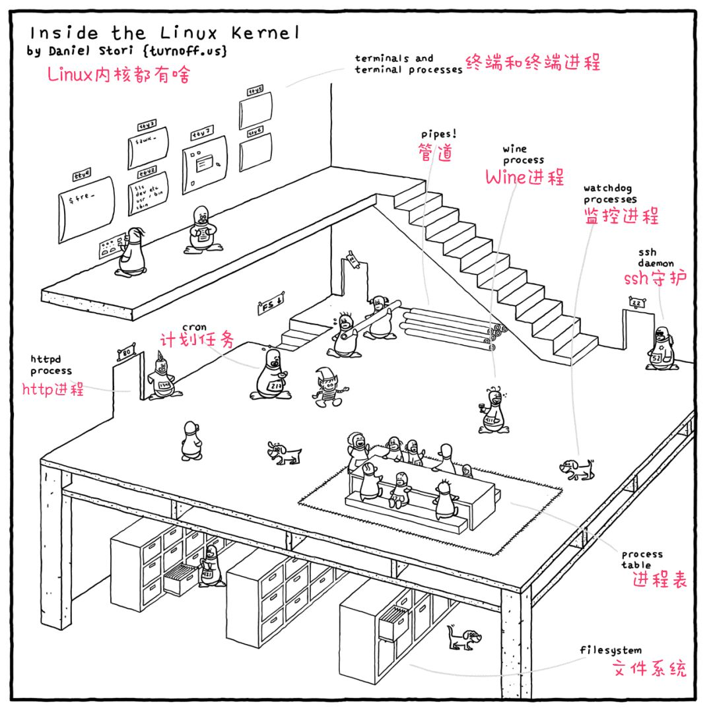

### 第八期

- **[用漫画了解 Linux 内核到底长啥样](https://www.sohu.com/a/380238636_231667)**  

- **[科学上网之 Brook](https://github.com/txthinking/brook)**  
Brook is a cross-platform strong encryption and not detectable proxy. Zero-Configuration.

- **[常用语言、框架等的 cheatsheets](https://devhints.io/)**  
一个博主提供的 `cheatsheet` 清单

- **[TypeScript 入门教程](https://ts.xcatliu.com/)**  
从 `JavaScript` 程序员的角度总结思考，循序渐进的理解 `TypeScript` --- **mark 就对了**

- **[Google 为 One 服务推出免费的 iOS 备份工具](https://new.qq.com/omn/20200730/20200730A0KFCQ00.html)**  
`One` 可帮助用户备份照片、视频、联系人和日历事件等资料。每个谷歌账户均拥有 15GB 免费的存储空间。

- **[每天都在用 SSH，你知道 SSH 的原理吗？](https://zhuanlan.zhihu.com/p/108161141)**  

- **[architecture.of.internet-product](https://github.com/davideuler/architecture.of.internet-product) (by @liao)**  
互联网公司技术架构，虽然最后更新是 `18年5月`，但是里边的架构讲解放到现在还是很实用，我刚看完日志系统方面的，准备再看下自动化运维的
- **[笔记/搜集/摘录/实践](https://github.com/jaywcjlove/handbook)**  
作者的一些笔记、实践，我过了一遍 `shell` 部分觉得很不错～

- **[Ubuntu Web --- 又一个 Chrome OS 挑战者](https://www.chainnews.com/articles/088350319039.htm)**  

- **[《Visual Studio Code 权威指南》](https://github.com/formulahendry/awesome-vscode-cn)**  
首本 `VS Code` 中文书，带你深入浅出 VS Code！(没有 pdf、mobi，有兴趣花钱买一本哈)

- **[LG UltraFine 4K 开箱](https://get233.com/archives/lg-ultrafine-4k.html)**  
啥时候我也能有个 4k 开箱，5k 就不奢求了...

--- 

以上是 weekly 第八期分享的内容。如果大家有好的技术知识希望积极投稿，论坛私信 @potato 或者其它方式都可以。

#### PS
>如果对其 weekly 有任何建议和看法，可以联系 @potato