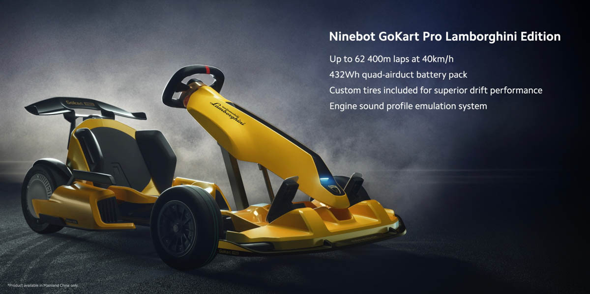

### 第九期

- **小米 & Lamborghini 携手推出 Go Kart 卡丁车**

- **[GitHub 故障 4 个半小时](https://www.sohu.com/a/412451847_465914)**  
因 DNS 和 Kubernetes 导致 GitHub 故障 4 个半小时：7 月 13 日故障报告，相信有同事在那天访问 GitHub 的时候都是返回 500，不过构成 GitHub 核心功能的 Git 操作在 7月13日 却没有受到影响。

- **[nacos](https://nacos.io/zh-cn/docs/what-is-nacos.html)**  
nacos 提供了一组简单易用的特性集，帮助您快速实现动态服务发现、服务配置、服务元数据及流量管理。近期我们公司在调试引入 nacos 中，也相信 nacos 后续能给大家带来更多实用性的功能

- **[UnblockNeteaseMusic](https://github.com/nondanee/UnblockNeteaseMusic)**  
解锁网易云音乐客户端变灰歌曲。**不多介绍啦，动手马上就能实现网易云听周杰伦歌曲~**

- **[微软公布 Windows Terminal 2.0 路线图](https://www.oschina.net/news/116415/windows-terminal-v2-roadmap)**  
微软首次宣布开源 [Windows Terminal](https://github.com/microsoft/terminal) 后吸引了众多 windows 使用者关注，在 Build 2020 后宣布 Windows Terminal [1.0](https://devblogs.microsoft.com/commandline/windows-terminal-1-0/) 版本的正式归来，2.0 的路线图也随之公布。

- **[网易数帆 Curve 分布式存储开源](https://segmentfault.com/a/1190000023322856)**  
网易数帆宣布：开源一款名喂 [Curve](https://github.com/opencurve/curve) 的高性能分布式存储系统，性能可达 Ceph 的 1.84 倍。最近在看 Ceph 方面的知识，没想到网易推出的这款也很猛。

- **[东芝正式退出笔记本电脑业务， Dynabook 成为夏普全资子公司](https://www.517japan.com/viewnews-112958.html)**  
忘记以前是哪个明星代言过 TOSHIBA 笔记本来着～ hhm？

- **[微软 Surface Duo 手机](https://tech.sina.com.cn/notebook/pad/2020-08-12/doc-iivhuipn8291703.shtml)**  
Surface Duo 将于 9月10日 在美国上市发货，Surface Duo 定价 1399 美元

- **[Can't Unsee](https://cantunsee.space/)**  
一个游戏，你注重细节可以赚取很多钱币

--- 

以上是 weekly 第九期分享的内容。上周因为个人原因没有按时分享周报内容，请见谅，也请多多支持～  
如果大家有好的技术知识希望积极投稿，论坛私信 @potato 或者其它方式都可以。

#### PS
>如果对其 weekly 有任何建议和看法，可以联系 @potato