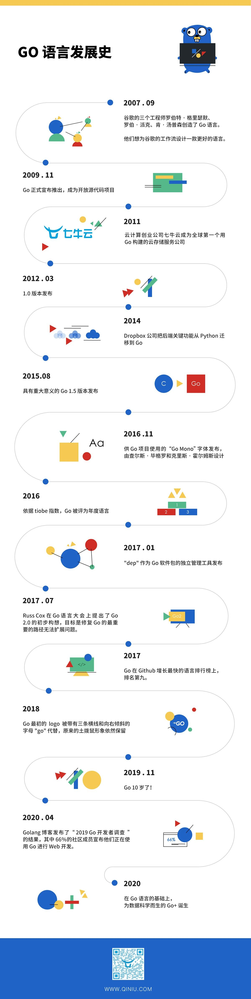

### 第十期

- **七牛云分享的 Go+ 前世今生**

- **[用 Python 写个消消乐游戏](https://mp.weixin.qq.com/s/P2Y3E8nt7rRppX9IqoukgQ)**  

- **[中文技术文档的写作规范](https://github.com/ruanyf/document-style-guide)**  
写技术文档，从写作规范做起～

- **[dive](https://github.com/wagoodman/dive)**  
一款按层分析 docker 镜像的工具

- **[kompose](https://github.com/kubernetes/kompose)**  
利用一个简单的 kompose up 命令，就可以在 Kubernetes 集群上启动 Compose 应用

- **[如何成为顶尖管理者](https://mp.weixin.qq.com/s/ONJ2DWLwhjP0YGFwzWeJfw)**  
相比专业能力，管理能力是一个影响因素更多、更复杂混沌，非线性的能力

- **[推箱子](http://lulea.github.io/game-off-2012/)**  
推箱子的 3D 版本，无聊玩一玩看能到第几关

- **NBA 直播资源**
CBA 季后赛刚结束不久，广东夺得冠军，随后 NBA 季后赛也在进行当中，下面分享一些能看直播的资源
**比赛直播基本都为早晨，喜欢看 NBA 的周末看看就好~**
**对了，低调看球!!!**
  - [abc国外解说](http://nba-streams.xyz/)
  - [360直播](https://m.zb06.com/live/lanqiu/)
  - [溜溜体育](http://www.jrkan.com/?lan=2)
  - [酷玩直播](http://www.102345.vip/nba)

--- 

以上是 weekly 第十期分享的内容。如果大家有好的技术知识希望积极投稿，论坛私信 @potato 或者其它方式都可以。

#### PS
>如果对其 weekly 有任何建议和看法，可以联系 @potato