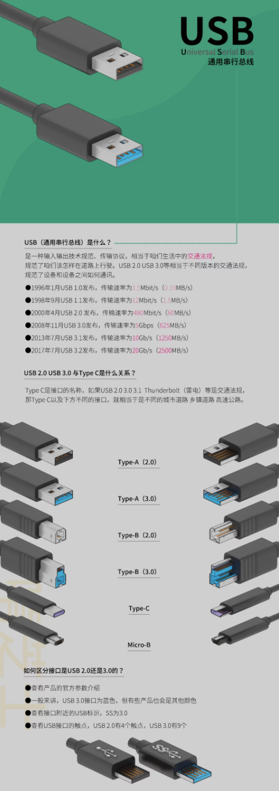

### 第十一期

- **如何分辨USB 2.0和3.0？跟Type-C是啥关系？**

- **[彻底弄懂TCP协议：从三次握手说起](https://mp.weixin.qq.com/s/6LiZGMt2KRiIoMaLwx-lkQ)**  

- **[Android 11 重磅更新](https://mp.weixin.qq.com/s/8JfcPt2A6pYpV8cal_7p8Q)**  
`#People #Controls #Privacy`

- **[文件存储、块存储还是对象存储?](https://www.redhat.com/zh/topics/data-storage/file-block-object-storage)**  
  - **文件存储**，主要操作对象是文件和文件夹  
  - **块存储**，主要操作对象是磁盘  
  - **对象存储**，主要操作对象是对象  

- **[SwiftUI 的一些初步探索](https://onevcat.com/2019/06/swift-ui-firstlook/)**  
作者已经计划写一本关于 SwiftUI 和 Combine 编程的书籍，希望能通过一些实践案例帮助您快速上手 SwiftUI 及 Combine 响应式编程框架，掌握下一代客户端 UI 开发技术。

- **[阿里巴巴发布国内首个公益区块链标准](https://www.chainnode.com/post/470507)**  
让天下没有难做的公益，未来评价公益项目好坏的首个标准是有没有上链

- **[mysql 自增 id 超大问题查询](https://segmentfault.com/a/1190000017268633) (by @dennis)**  
`REPLACE INTO ...` 和 `INSERT INTO ... ON DUPLICATE KEY UPDATE ...` 对主键的影响，看了这篇后除了博主说的三种解决方案后，你有更好的方法吗？

- **[明年起华为手机将全面支持鸿蒙系统](http://m.news.cctv.com/2020/09/10/ARTIDdwZG0SH4zN3CxraZzbG200910.shtml#:~:text=%E9%B8%BF%E8%92%99%E7%B3%BB%E7%BB%9F%E8%87%AA%E4%BB%8E%E5%8F%91%E5%B8%83%E4%BB%A5%E6%9D%A5,%E9%B8%BF%E8%92%99%E7%B3%BB%E7%BB%9F%E7%9A%84%E6%99%BA%E8%83%BD%E6%89%8B%E6%9C%BA%E3%80%82)**  
刚刚 `鸿蒙2.0` 亮相，明年起华为手机将全面搭载

- **[数字益智游戏](https://www.abefehr.com/parity/)**  
我玩到 5 暂时放弃了，你们可以试试看!

--- 

以上是 weekly 第十一期分享的内容。上两周因为各种原因没有按时分享周报内容，请见谅，也请多多支持～  
如果大家有好的技术知识希望积极投稿，论坛私信 @potato 或者其它方式都可以。

#### PS
>如果对其 weekly 有任何建议和看法，可以联系 @potato