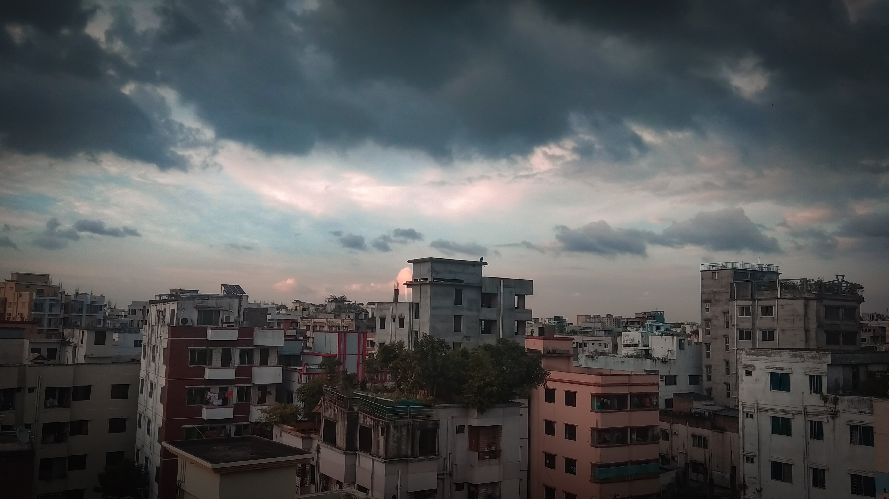

### 第十四期
--- 
- **即将下雨**  

- **交互式环境学习 Kubernetes**  
使用交互式环境学习 Kubernetes，无需下载或配置 
    - [Katacoda](https://www.katacoda.com/courses/kubernetes)
    - [Kubernetes Bootcamp](https://kubernetesbootcamp.github.io/kubernetes-bootcamp/index.html)
    - [Magic Sandbox](https://www.msb.com/)

- **[Derrick](https://github.com/alibaba/derrick)**  
Derrick 专注于本地开发环境中开发人员的工作流  
Derrick 将检查您的工作区并生成 `Dockerfile，docker-compose.yml，Jenkinsfile` 等
    - [Derrick wiki](https://github.com/alibaba/derrick/wiki/%E9%A6%96%E9%A1%B5)
    可以 init 感受一下，有兴趣也可以深入理解 Derrick 的工作原理

- **[SoloPi](https://github.com/alipay/SoloPi)**    
SoloPi 是一个无线化、非侵入式的 Android 自动化工具，公测版拥有录制回放、性能测试、一机多控三项主要功能，能为测试开发人员节省宝贵时间

- **[ios14 skins](https://ios-skins.com/)**  
最佳iOS 14主题的最新集合，有付费版的，也有免费版的

- **[Iterm2-color-schemes](https://iterm2colorschemes.com/)**  
以前习惯自己慢慢调色，后面觉得还是别人调好的舒服些，时不时换一下也能调整下心情～最近用的是 [arthur](https://raw.githubusercontent.com/mbadolato/iTerm2-Color-Schemes/master/schemes/Arthur.itermcolors) 主题

- **[个人护城河](http://www.ruanyifeng.com/blog/2020/09/weekly-issue-127.html)**
你的个人护城河是一组独特的且不断累积的竞争优势，别人很难学习，或者很难做到。如果你有了它，你会让自己变得无法取代。  
护城河会随着条件的变化而变化。比如，录音技术诞生之前，稀缺的是音乐本身，你想听音乐，就需要有一个艺术家给你现场表演。现在，音乐录音到处都是，稀缺的是策划、发行和个性的展示。    
**技术平平的程序员日后要怎么生存下去，是不是该发展一下个人护城河**

- **[谷歌拟为YouTube增添电商相关功能](http://www.dsb.cn/129057.html)**  
谷歌要把旗下视频网站 Youtube 变成一个主要的购物目的地，从而成为亚马逊和阿里巴巴的竞争对手。Youtube 要求创作者使用 YouTube 软件，并标记和跟踪他们视频作品中的产品。
    - [谷歌也忍不住了，在海外试起了短视频带货](https://tech.sina.cn/2020-08-11/detail-iivhvpwy0387924.d.html)

--- 

以上是 weekly 第十四期分享的内容。**(拖延症老犯，所以前两周没有作出分享，接下来要对周报走心一些)**  
如果大家有好的技术知识希望积极投稿，论坛私信 @potato 或者其它方式都可以。

#### **PS**
>如果对其 weekly 有任何建议和看法，可以联系 @potato