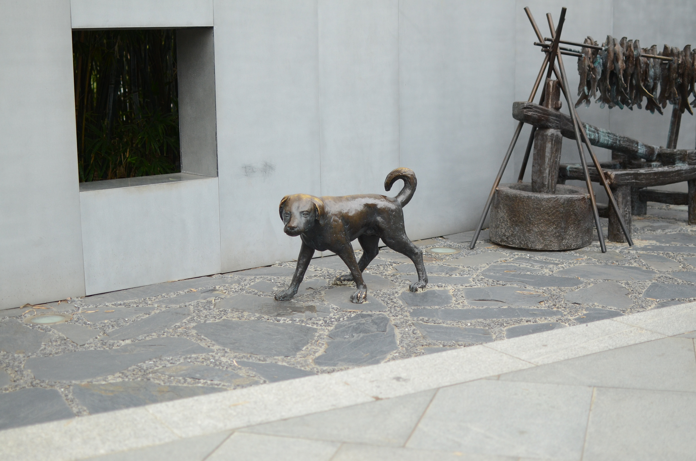

### 第十六期
--- 

- **狗铜雕像**  

- **[translate-tab](http://translate-tab.com/)**  
菜单栏翻译插件，封装了谷歌翻译，支持自动识别语言

- **推荐两款作图工具**  
  - [Draw.io](https://app.diagrams.net/)
  - [OmniGraffle](https://www.omnigroup.com/omnigraffle/)
  - [Monodraw](https://monodraw.helftone.com/) --- [破个解](https://macwk.com/soft/monodraw)

- **推荐两款待办事项工具**  
目前我使用的是 todo，但还是觉得有些过于简单，而且不同组内清单名字也不可一样
  - [Microsoft todo](https://to-do.microsoft.com/)
  - [2Do](https://www.2doapp.com/)

- **[一次假期故障引发的性能优化思考](https://tech.youzan.com/eduperform/)**  
该篇讲述了有赞技术团队响应及时，再经过很短时间的问题分析后，迅速的恢复了系统，保障了商家直播顺利进行；同时也给我们指定了几个方向做一些优化点

- **[单点登录与权限管理本质：session 和 cookie 介绍](https://juejin.im/post/6844903567803826190)**  
`session` 是在服务端保存的一个数据结构，用来跟踪用户的状态，也可以保存用户相关的一些数据，可以保存在内存、缓存、数据库等存储结构中。  `cookie` 是客户端保存用户信息的一种机制。

- **[计时攻击 TIMING ATTACKS](https://coolshell.cn/articles/21003.html) (by @dennis)**
看完后很多疑问点后问过东哥，但是发现还是很多不懂的知识点 -^^^^^-

- **[Engadget 中国版](https://cn.engadget.com/)**  
`Engadget` 是一个关于消费电子产品的流行科技网志与播客，在 `Engadget` 上可以看到很多新奇古怪的数码玩意和编辑写的评测性文章，这种评测性质的文章对于读者全面了解一个产品很有帮助

- **[久坐办公室如何保护身体健康？](https://www.zhihu.com/question/28684752/answer/572468162) (by @felix)**  
看完这篇，对自己的身体继续走点心！

--- 

以上是 weekly 第十六期分享的内容。
如果大家有好的技术知识希望积极投稿，论坛私信 @potato 或者其它方式都可以。

#### **PS**
>如果对其 weekly 有任何建议和看法，可以联系 @potato