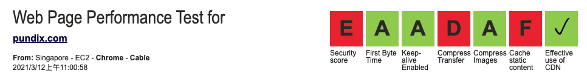

### 第二十一期

- **That One Game**  

不知道你的 "旧东西" 里能找出什么来呢

- **[Speedtest-cli](https://github.com/sivel/speedtest-cli)**  
基于 Python 开发的脚本程序，利用了 [speedtest.net](https://www.speedtest.net/zh-Hans/apps/cli) 的服务来测量出上下行的宽带 **（最近无论在哪，网络都好差...）**

- **[netdata](https://github.com/netdata/netdata)**  
`netdata` 是一款 Linux 性能实时监测工具，还能与 Prometheus 和 Grafana 等做集成，我简单部署了一个，确实很炫酷，不过好像没有账号密码之类的验证

- **[webpagetest](https://github.com/WPO-Foundation/webpagetest) (by @parker)**  
[webpagetest](https://www.webpagetest.org/) 是一个非常详细且专业的 web 页面性能分析开源工具，提供了全球多个地点的测试，也有视频和截图回放体验，最主要的还是它所分析的指标很有参考价值，术语词也不少，所以也提供了 Glossary 表格供参考。
    - 贴下 pundix.com 的检测，看报告了解到需要优化哪部分
    
        - 缺乏一些安全标头
        - 使用浏览器缓存
        - [优化图片](https://developers.google.com/speed/docs/insights/OptimizeImages)

- **[游戏程序员的学习之路](https://github.com/miloyip/game-programmer) (by @liao)**  
miloyip/game-programmer 游戏程序员的学习之路，非常系统完整地介绍了游戏程序员应当阅读的书籍，可以看中文版的 pdf，会有对应的中文书籍推荐

- **[CMP HX](https://www.nvidia.com/en-us/cmp/)**  
Nvidia 推出挖矿专用显卡 CMP HX，基本上是在面向游戏玩家的显卡的基础上，去掉了显示输出和挖矿散列速率限制

- **[kaix.in](https://kaix.in/)**  
作者是一家咖啡店的老板，blog 主要涉及咖啡、影音内容，不过也有很多生活记录，感觉作者开的咖啡店很有味道

--- 

以上是 weekly 第二十一期分享的内容。如果大家有好的技术知识希望积极投稿，论坛私信 @potato 或者其它方式都可以。

#### PS
>如果对其 weekly 有任何建议和看法，可以联系 @potato

>**如果有同事在后海地铁站 J 出口出来的，可以直接乘坐 b669 公交车到公司楼下的那个天桥站台，我认为很方便，因为总觉得走那个天桥过来是在绕路哈哈哈...**