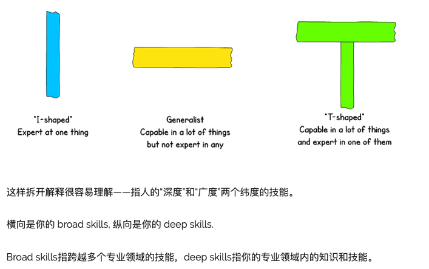

### 第二十三期

- **Clarence Weems**  

**再次送给北京准绝杀**

- **[Cookie Editor](https://www.hotcleaner.com/cookie-editor/)**  
Chrome 浏览器一个很好的 cookie 管理器，可以直接查看、修改或添加 cookie

- **[Syncthing](https://github.com/syncthing/syncthing)**  
Syncthing 是一款开源免费跨平台的文件同步工具，是基于 P2P 技术实现设备间的文件同步，所以它的同步是去中心化的

- **[30个 shell alias 推荐](https://www.cyberciti.biz/tips/bash-aliases-mac-centos-linux-unix.html) (by @dennis)**  
可以打造一个属于自己的 shell aliases，换哪个设备都能快速敲出熟悉的别名

- **[我们如何从剧本文件中生成视频](https://blog.openresty.com.cn/cn/ordemo/)**  
通过 [OpenResty](https://openresty.com.cn/cn/) Demo 工具链生成教程视频的，主要通过剧本文件自动生成视频，还有配音和字幕。  
**wow 真的好强，目前是提供给他们的商户使用，也可以去官网申请试用，日后可能会以 saas 方式提供。**

- **[如何通过少学习成为 T 型人才](https://time.geekbang.org/column/article/263992)**  

- **[16personalities](https://www.16personalities.com/ch/%E4%BA%BA%E6%A0%BC%E6%B5%8B%E8%AF%95)**  
有 16 种人格类型，通过 10分钟左右的测试，可以测出你属于哪一种，我觉得还是挺有参考价值的哈~

- **[区块链周报](https://www.infoq.cn/article/43z32fimOmDLTXVSVhQY?utm_source=rss&utm_medium=article)**  

--- 

以上是 weekly 第二十三期分享的内容。如果大家有好的技术知识希望积极投稿，论坛私信 @potato 或者其它方式都可以。

#### PS
>如果对其 weekly 有任何建议和看法，可以联系 @potato